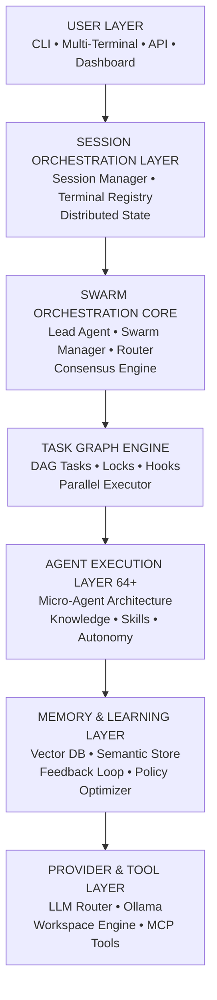
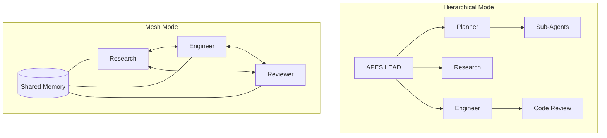
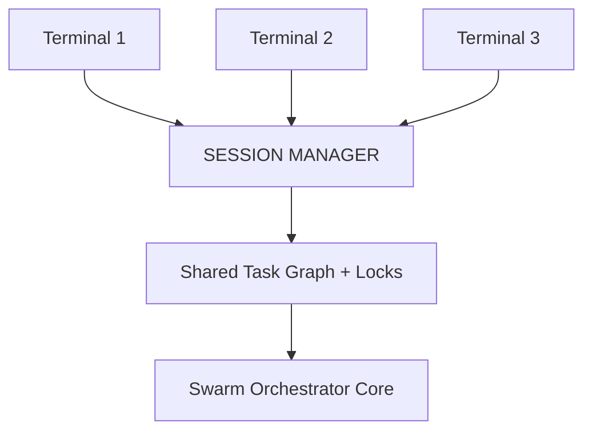
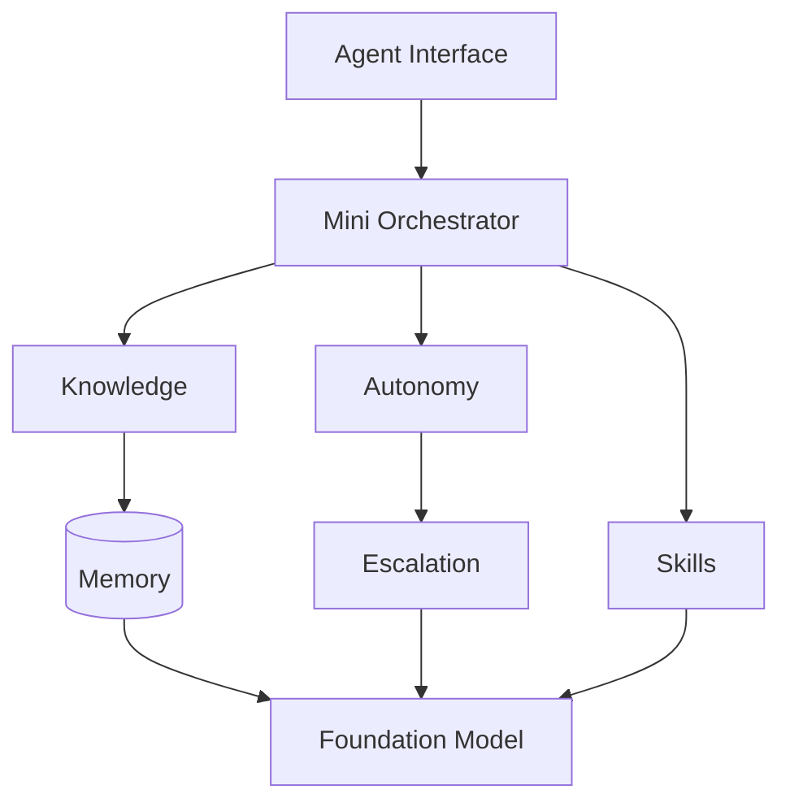
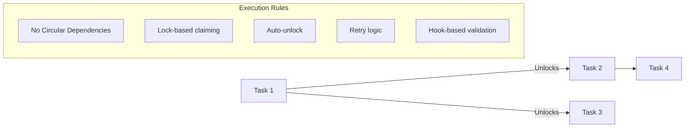
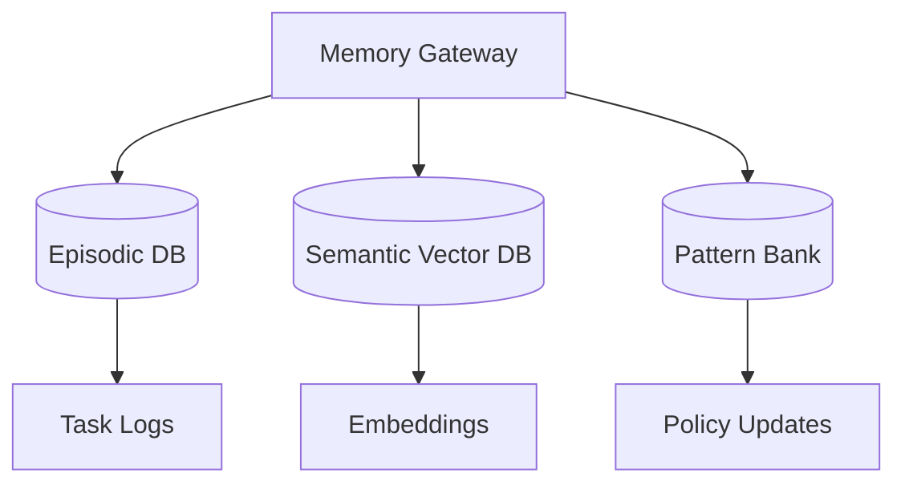
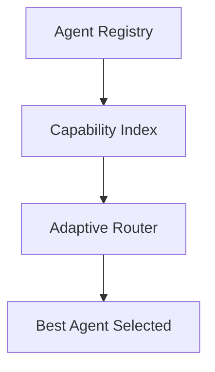
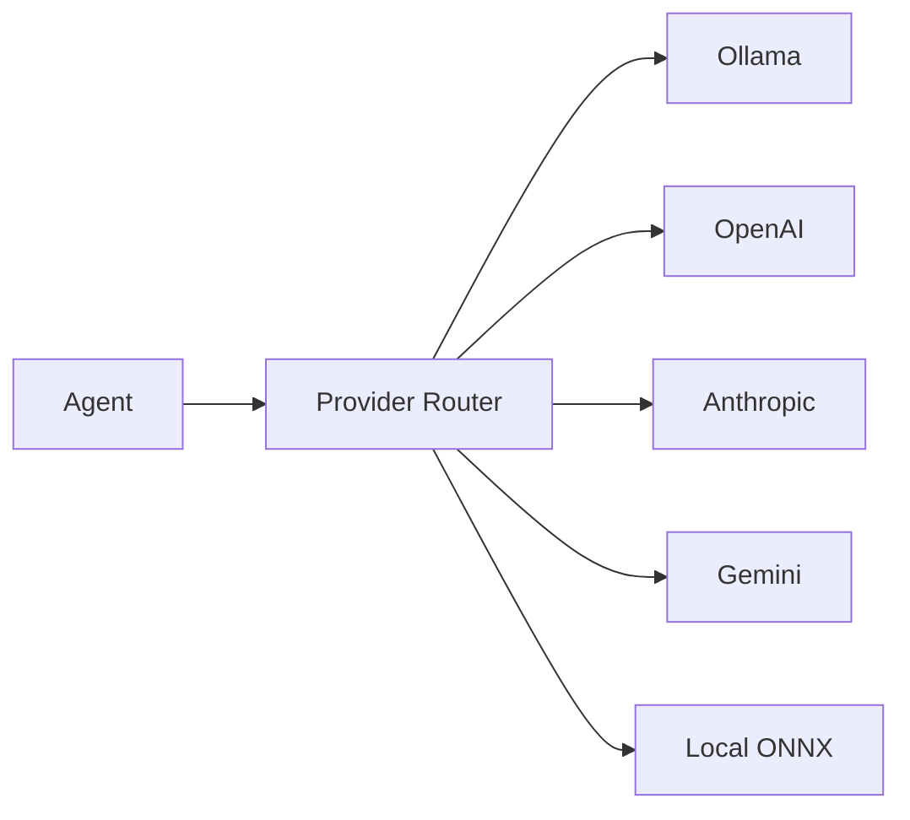

# APES v2 Full Enterprise Architecture Blueprint

This document contains Mermaid diagrams and structural models for APES v2, a swarm-native orchestration platform, representing the deep structural requirements for APES.

## 1. Layered System Architecture

## 2. Swarm Orchestration Topologies

APES supports dynamic formation of multiple agent coordination strategies:

## 3. Distributed Multi-Terminal Model

## 4. Agent Internal Micro-Architecture

Each of the 64 agents contains a localized pipeline for execution safety.

## 5. Task Graph Engine (DAG)

## 6. Memory System Architecture

## 7. Router + Capability Registry

## 8. Provider Abstraction Layer

